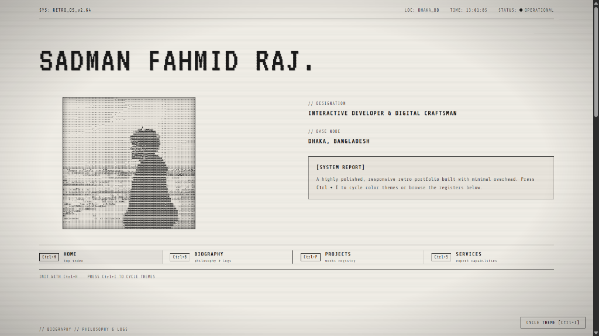

# SADMAN FAHMID RAJ // RETRO_OS v2.64

A highly polished, responsive retro terminal-style portfolio built with raw performance and premium aesthetics in mind. Featuring a real-time video-to-ASCII canvas processing engine, Web Audio keystroke mechanical synthesizers, and staggered scroll reveals.

Live local development served via Vite.

---

## ⚡ Features

* **🎥 Real-Time Video-to-ASCII Canvas**: Dynamically processes video frames on the fly, rendering grayscale pixel intensities into a character matrix so the ASCII portrait sways and moves in sync with the waves and wind.
* **🌓 Dual-Contrast Color Themes**: Classic Light Mode (warm paper) and Theme-Dark Mode (luminous white characters on black). In dark mode, the silhouette dynamically inverts to remain highly visible.
* **⌨️ Snappy Typewriter & Keystroke Audio**: Keyboards typing effects sync with Web Audio mechanical clack synthesizers and boot chimes.
* **🔄 Interactive Hover Scrambling**: Title headers and navigation links shuffle cyber-glitch characters on hover, decoding back to clean text in just `150ms`.
* **🎨 Dynamic SVG Favicon**: The browser tab icon (`>_` prompt) automatically swaps colors to match the active theme.
* **🎛️ Scroll-Spy Auto-Navigation**: The navigation bar automatically tracks scroll positions and highlights the corresponding section.
* **📜 Staggered Cards Reveal**: Cascade layouts slide and fade in smoothly as they enter the viewport.

---

## 🛠️ Technology Stack

* **Core**: Vanilla HTML5, Vanilla ES6+ Javascript
* **Styling**: Tokenized CSS3 Grid & Flexbox, VT323 & Share Tech Mono Typography
* **Bundler & Server**: Vite
* **Engines**: HTML5 Canvas API (Real-time frame sampler & ambient rain background), Web Audio API (Chime/Typewriter Synth)

---
